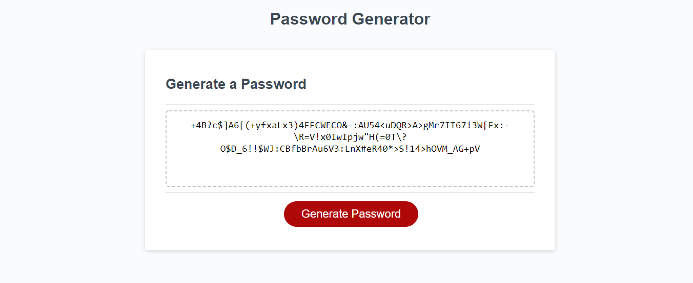

# random-password-generator
# Read Me

This repo contains code for a random password generator. My work can be found in the scripts/script.js file. To see the deployed application, please visit [dvorakjt.github.io/random-password-generator/](https://dvorakjt.github.io/random-password-generator/)

# Background: Creating Arrays
When presented with this project, I realized that the basic formula would involve having an array or arrays of characters from which to pull. Obviously, I could type these out, but I also wanted to set out to determine whether it would be possible to write functions that generate these arrays for me.  **Note: all code listed below is found in the scripts/script.js directory.**

## The Code
After a lot of tinkering, I was able to create code that generates arrays of characters for the user. The way I accomplished this was by looping through a set number of iterations, and then assigning a character to an element of an array based on that character's unicode number. In practice, this code looks like this:

    for (let  j = 0; j < this.range; j++) {
	this.array[j] = String.fromCharCode(this.startUC + j);
	}

You will notice several instances of the `this`keyword. "This" is because I decided that creating an array of character set objects (`charSets[]`) would be the most efficient way to call on specific characteristics of various character sets later on, such as whether they were on or off, what characters they contain, etc. This also enables the user to very easily add new character sets.

speaking of character sets and Unicode, you will notice the following line of code in line 8 of the script:

    var  data = ["lower case letters", 97, 25, "upper case letters", 65, 25, "numbers", 		
    48, 9, "special characters", 33, 13, "special characters", 58, 7, "special 
    characters", 91, 5;

this array consists of names of character sets followed by the Unicode number of the first character of the set, followed by a number that is one lower than the total number of characters in the set.

from here, I have code that generates objects based on each of these values and adds them to the charSets[] array:

    for (let  i = 0; i < (data.length / 3); i++) {
	    const  index = i * 3; //every 3rd item in data is the beginning of a new charSet
	    charSets[i] = {    
		    name:  data[index],    
		    startUC:  data[index + 1],    
		    range:  data[index + 2],    
		    array: [],    
		    on:  false,    
		    popArray:  function () {    
			    for (let  j = 0; j < this.range; j++) {
			    this.array[j] = String.fromCharCode(this.startUC + j);
		        }
	        }    
	    }
	    charSets[i].popArray();
    }

This code loops through an iteration that is 1/3rd the length of the data array, so that i can increase consecutively, and new charSets are therefore assigned a consecutive index number. Then, a const
named index is declared which is equal to i*3, and is used to refer to the index number in data[] that you are currently accessing. With each iteration of the loop, a new element in charSets is created. The element adopts the string value at `const index`, the starting Unicode value at `index+1` and the length of iteration at `index+2`. The new object is given properties of on (default setting is false), and a function called popArray that populates the array using the Unicode value and range specifed in data.

### Evaluation - 
**Positives**
While I am not sure that it was worth it to go through all of this rather than simply type or copy and paste strings of various characters, it was fun to figure out, and the array of objects does prove useful later on in handling these character sets. Moreover, it is **extremely** easy to add new character sets to the program. For fun, please try adding: 

    , "Latin 1 Punctuation Marks", 161, 30]

To the end of the data array. This will add a new charSet with a lot of fun symbols. Just adding this one 
item of code here is enough for the whole program to still function, which I think could be valuable. In reality, you could add 
`,"any string you want, naming the character set", any_unicode_value, any_range]`

And the program will include it.

**Issues (solved)**
The one issue I encountered is that common special characters have nonconsecutive unicode numbers. To combat this I added a function that the programmer can use to easily combine any charSets they want, while deleting the resultant redundant ones.
The function is found here: 

    function  combineArrays() { /*this function takes the charSets index number of 
    arrays you wish to combine*/
	   for (let  m = 1; m < arguments.length; m++) {
	   //the first argument is the array into which other arrays are concatenated
		   charSets[arguments[0]].array = 		
		   charSets[arguments[0]].array.concat(charSets[arguments[m]].array);
		   delete  charSets[arguments[m]]; /*delete the charSet objects containing 	
		   arrays that were added the first*/
	    }
    }
When callling the function, simply provide the index numbers of the arrays you wish to combine. For instance `combineArrays(3,4,5);` combines the special characters array in this example. It then deletes the second two special characters arrays, because they now appear in one array, charSet[3].
Delete does not change index numbers, so if you want to then use combineArrays() with hypothetical charSets[6,7,8,9,10], it will still work properly. Additionally, it can take any number of arrays, and it can also combine non-consecutive arrays. In my program, I only called combineArrays(3,4,5), but there is flexibility for "future developers" to add new arrays and easily combine them if they so chose.

# Fast-forward: Generating a Random Password
## User Input
Ok, so now we have a bunch of arrays, inside of objects, all inside of one big charSets[] array. What do we do with them?

Well the first thing is for us to figure out which ones the user wants to utilize (and therefore require at least one of). To do this I created a function called askUser(). Let's focus on the first half of askUser().

    function  askUser() {
    //reset values
    password = "";
    fullCharSet.splice(0, fullCharSet.length);
    minCharOn = false;
    do {
	    charSets.forEach(enableAndCombineArrs);
	    if (!minCharOn) alert("Please select at least one character type."); //if they 
	    have not selected at least one type, continue looping
    } while (!minCharOn)
    //ask the user for a password length

First, askUser() resets the values of several global variables. password becomes an empty string. the fullCharSet[] array is completely wiped away by using splice to delete a total number of its elements equal to its length beginning at index 0.  Finally minCharOn is set to false. This is the variable that simply says "has the user selected at least one character type?"

Next in the code is a do while loop. This loop continues only as long as the user hasn't selected at least one character type to use in the password. A do while loop ensures that it executes at least once.

Inside the loop enableAndCombineArrs is called forEach charSet. Enable and combine arrays is previously defined thus:

    enableAndCombineArrs = function (element) {
		element.on = false;
		element.on = confirm("Would you like to enable and require a minimum of one " + 	
		element.name + "?");
		if (element.on) {
			fullCharSet = fullCharSet.concat(element.array);
			minCharOn = true;
		}
	}
    
This callback function takes an element of the charSets array. It first resets the element.on to false as a safeguard for when passwords are generated multiple times. Then, it presents the user with a confirm window that asks if the user would like to enable this specific charSet. The fact that this occurs as part of a loop through all charSets, which are themselves generated by a loop makes the program highly flexible. Simply by adding to the data variable, the rest of the program adapts itself. 
If the element is on, it then adds the charSet to the fullCharSet, and sets the minCharOn to true, ending the do while loop as soon as the for loop is complete.

The next part of askUser() asks the user for a password length. This was tricky to figure out. I wanted to guard against non-integer inputs. I kept trying to figure out how to work with the NaN (Not a Number) output that parseInt creates when the first character is not a number. When I googled the answer, I learned that NaN is not equal to itself, and is the only value not equal to itself, so it can be checked for using variable !== variable. If this evaluates to true, then parseInt returned NaN, and the loop needs to repeatedly ask the user for a a valid number.

    do {
	    passLength = prompt("How many characters long should the password be? Available 
	    range is 8 to 128.");
	    passLength = parseInt(passLength);
	    if (passLength !== passLength || passLength < 8 || passLength > 128) 		
		    alert("Please enter a valid integer value within the range.");
    } while (passLength !== passLength || passLength < 8 || passLength > 128) 

The next 3 functions do 3 important things:
addToPass() selects element of each required charSet and adds it to the beginning of the password.

completePass() fills out the remaining characters of the password with random characters from the aggregate character set (fullCharSet[]).

reOrderPass() then shuffles the order of the characters of the password so that the required characters don't appear in a predictable order at the beginning of the password.

## generatePassword()
The function generatePassword() brings all of these functions together. First, it asks the user for their password criteria using askUser().
then, forEach of the charSets, it enablesAndCombines that charSet if charSets[index].on is true.
Then, it adds the required characters to the password, adds more random characters, and then shuffles them all up.

Finally, writePassword(), which is called using an addEventListener tag on the generateBtn , calls generatePassword() and then writes the password to the the value of passwordText, which is selected using a querySelector to find the #password id in the html.

